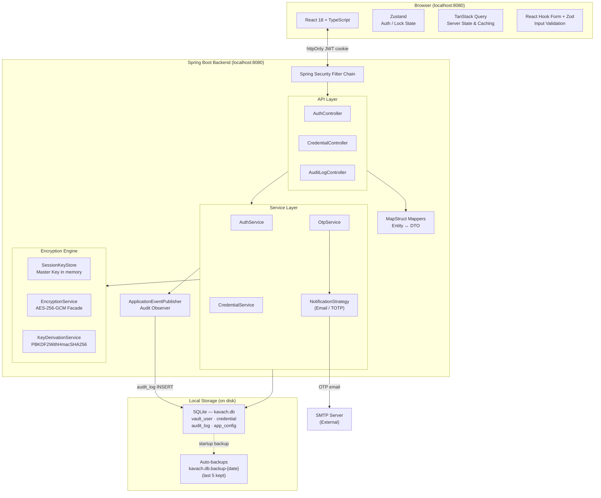
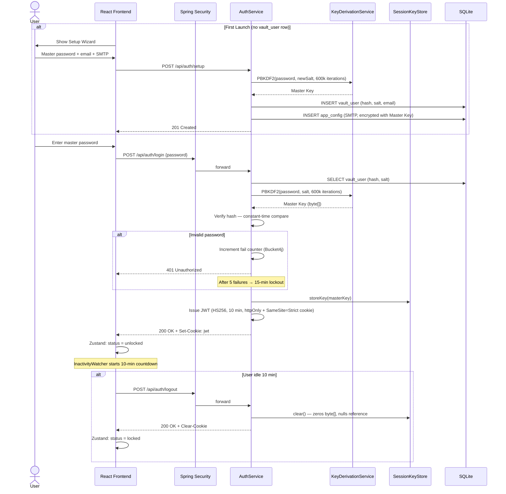
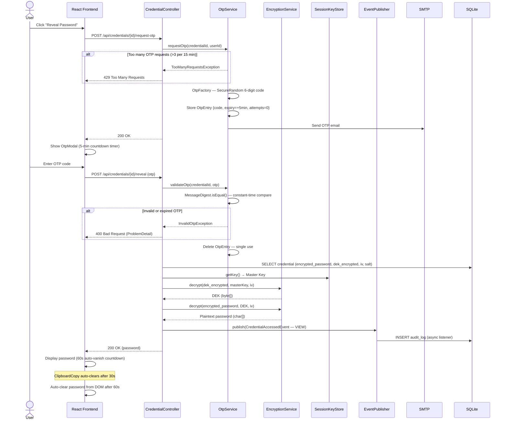
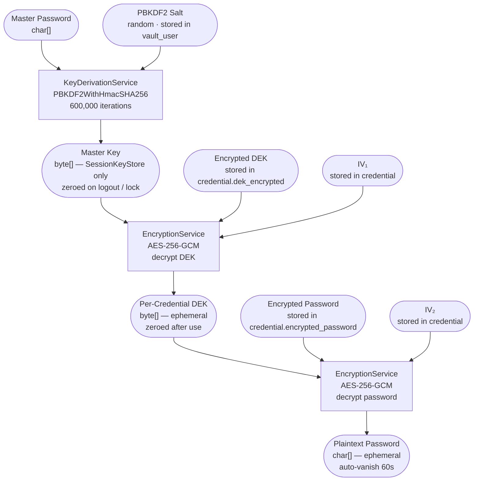
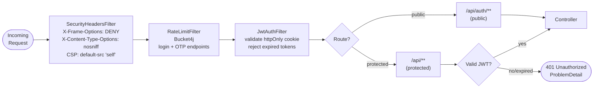
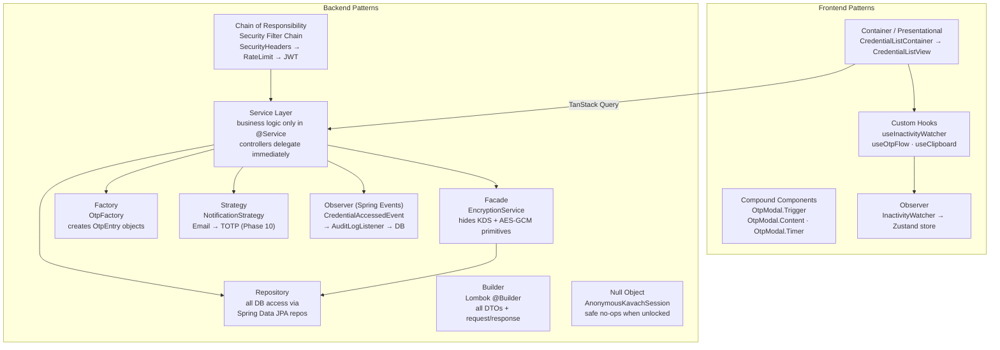
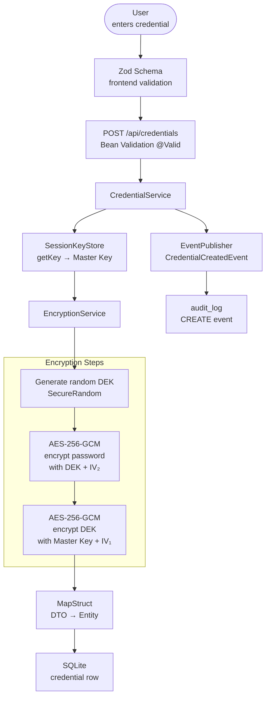

# Kavach — Architecture Diagrams

> **Kavach** (कवच) — Sanskrit for *shield* or *armour*.

---

## 1. System Component Overview

---

## 2. Authentication & Session Flow

---

## 3. Credential Reveal Flow (OTP)

---

## 4. Encryption Key Hierarchy

---

## 5. Spring Security Filter Chain

---

## 6. Design Patterns — Interaction Map

---

## 7. Data Flow — Add Credential

